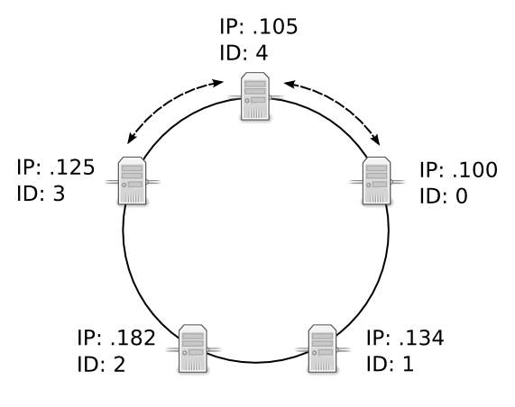

Cluster Organization
====================

.. ### "Cluster Organization" Content Plan
   - Definition of the Cluster (show web bridge?)
   - Definition of a node (show node details from web bridge?)
   - Links between nodes, concepts of predecessor and successor
   - Stabilization, reorganization into a ring (explain what happens for both adding and removing a node)
   - Talk about cluster efficiency and performance
   - The Client(s) - quick overview of what a client is, then refer to Data Transfer
   
What is a Cluster?
------------------

A cluster is one or more nodes that communicate with each other to share and serve data. A node is any computer running qdbd, the quasardb daemon.

.. Expand this section using the definitions of nodes, clusters, and links from a Chord perspective

As nodes come online, the cluster will automatically *stabilize* it self. :term:`Stabilization` is the process during which nodes agree on how and where the data should be distributed. 

The stabilization duration depends on the number of nodes. In our case the cluster should be fully stabilized in less than twenty seconds.

If a node fails, the data it was responsible for will not be available, but the rest of the cluster will detect the failure, re-stabilize itself automatically and remain available.

Adding a Node to a Cluster
--------------------------

.. figure:: qdb_add_node_process/01_qdb_cluster_at_start.png
   :scale: 50%
   
   Four nodes connected in a ring, forming an operational cluster.

.. figure:: qdb_add_node_process/02_qdbd_add_node.png
   :scale: 50%
   
   A fifth node is created and peered to the node at IP address 192.168.1.134. This begins the two-step process of :term:`Stabilization`, where nodes validate their position in the ring, then rearrange how and where data is distributed.
   
   Note that the fifth node assigned itself the unique ID of 4. In a production environment, the IDs are randomized hashes. In the unlikely event that a new node assigns itself an ID that is already taken by another node in the cluster, the new node will abort the join and stabilization process. The cluster remains unchanged.

.. figure:: qdb_add_node_process/03_qdb_peering.png
   :scale: 50%
   
   The fifth node uses the predecessor and successor values of its neighbor nodes to move itself to its appropriate location within the cluster. In this example, it moves until it has a predecessor of 3 and a successor of 0.
   

   
   Once the node has a valid predecessor and successor, data is migrated based on the number of nodes and replication factor in order to load balance across the cluster. During this period, some nodes may be unavailable, namely the predecessor, the successor, and the node that was added.

.. figure:: qdb_add_node_process/05_qdb_cluster_at_end.png
   :scale: 50%
   
   Once data migration is complete, stabilization is complete and the finished cluster has five nodes.
