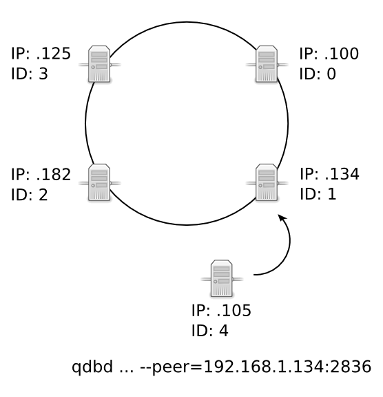

Cluster Organization
====================

What is a Cluster?
------------------

Each server running a :doc:`../reference/qdbd` is called a node. By itself, a node can provide fast key-value storage for a project where a SQL database might be too slow or impose unwanted design limitations.

However, the real power of a quasardb installation comes when multiple nodes are linked together into a cluster. A cluster is a peer-to-peer distributed hash table based on `Chord <https://github.com/sit/dht/wiki>`_. In a cluster, quasardb nodes self-organize to share data and handle client requests, providing a scalable, concurrent, and fault tolerant database.

.. _stabilization:

Stabilization
-------------

Stabilization is the process during which nodes agree on their position in the cluster. Stabilization happens when bootstrapping a cluster, in case of failure, or when adding nodes. It is transparent and does not require any intervention. A cluster is considered stable when all nodes are ordered in the ring by their respective ids.

In most clusters, the time required to stabilize is extremely short and does not result in any modification of order of nodes in the ring. However, if one or several nodes fail or if new nodes join the cluster, stabilization also redistributes the data between the nodes (see :ref:`data-migration`). Thus the stabilization duration can vary depending on the amount of data to migrate, if any.

Nodes periodically verify their location in the cluster to determine if the cluster is stable. This interval can vary anywhere from 1 second up to 2 minutes. When a node determines the cluster is stable, it will increase the duration between each stabilization check. On the contrary, when the cluster is determined to be unstable, the duration between stabilization checks is reduced.

Adding a Node to a Cluster
--------------------------

.. figure:: qdb_add_node_process/01_qdb_cluster_at_start.png
   :scale: 50%

   Four nodes connected in a ring, forming an operational cluster.

   A fifth node is created and peered to the node at IP address 192.168.1.134. The fifth node connects, then downloads the configuration of the cluster, overwriting its global parameters with the cluster's global parameters. This ensures that global parameters are consistent across the cluster, which is important for options like replication and persistence, where disparate parameters between nodes could cause unwanted behavior or data loss.

   Once the node has received and applied the global parameters, the cluster begins the three-step process of Stabilization, where nodes validate their position in the ring, then rearrange how and where data is distributed.

   Note that in this example, the fifth node assigned itself the unique ID of 4. In a production environment, the IDs are randomized hashes. In the unlikely event that a new node assigns itself an ID that is already taken by another node in the cluster, the new node will abort the join and stabilization process. The cluster remains unchanged.

   The fifth node uses the predecessor and successor values of its neighbor nodes to move itself to its appropriate location within the cluster. In this example, it moves until it has a predecessor of 3 and a successor of 0.

.. figure:: qdb_add_node_process/04_qdb_data_migration.png
   :scale: 50%

   Once the node has found a valid predecessor and successor, it will download the data for which it is responsible, without joining the cluster. From a resource point of view, this is equivalent to one client downloading a range of data from the cluster.

.. tip::
   Add nodes when activity is low to limit disruption.

   During the period, the cluster is fully operational and clients are unaware that a node is joining the cluster. 

   For more information on data migration, see :ref:`data-migration`.

.. figure:: qdb_add_node_process/05_qdb_cluster_at_end.png
   :scale: 50%

   Once the download is complete, the node will join the cluster, and download additional data that may have been added since it started to join the cluster.

   During this period, some nodes may be unavailable, namely the predecessor, the successor, and the node that was added. This hand-over rarely exceeds one minute.

   After the node has joined the cluster, nodes may elect to remove data that has been migrated to the new node, according to the replication policy of the cluster.

Removing a Node from a Cluster
------------------------------

When a node is removed through a clean shutdown, it informs the other nodes in the ring on shutdown. The other nodes will immediately re-stabilize the cluster. If data replication is disabled, the entries stored on the node are effectively removed from the database. If data replication is enabled, the nodes with the duplicate data will serve client requests.

When a node is removed due to a node failure, the cluster will detect the failure during the next periodic stabilization check. At that point the other nodes will automatically re-stabilize the cluster. If data replication is disabled, the entries stored on the node are effectively removed from the database. If data replication is enabled, the nodes with the duplicate data will serve client requests.

Entries are not migrated when a node leaves the cluster, only when a node enters the cluster.

Recovering from Node Failure
----------------------------

When a node recovers from failure, it needs to reference a node within the ring to rejoin the cluster. The configuration for the first node in a ring generally does not reference other nodes, thus, if the first node of the ring fails, you may need to adjust its configuration file to refer to an operational node.

If following a major network failure, a cluster forms two disjointed rings, the two rings will be able to unite again once the underlying failure is resolved. This is because each node "remembers" past topologies.

The detection and re-stabilization process surrounding node failures can add a lot of extra work to the affected nodes. Frequent failures will severely impact node performance.

.. tip::
    A cluster operates best when more than 90% of the nodes are fully functional. Anticipate traffic growth and add nodes before the cluster is saturated.

.. _nodes_is_info:

Nodes IDs
----------

Each node is identified by an unique 256-bit number: the ID. If a node attempts to join a cluster and a node with a similar ID is found, the new node will exit the cluster.

In quasardb 2.0 nodes ID are either automatic, indexed or manual. The syntax is as such:

 * automatic: auto
 * indexed: current_node/total_node (e.g. ``3/8`` for the third node of an 8 nodes clustter)
 * manual: a 256-bit hexadecimal number grouped by 64-bit blocks (e.g ``2545ef-35465f-87887e-5354``)

Users are strongly encouraged to use the indexed ID generation mode. In indexed mode, quasardb will generate the ideal ID for a node given it's relative position. For example, if you have
a 4 nodes clusters, each node should be given the following id:

 * node 1 - ``1/4``
 * node 2 - ``2/4``
 * node 3 - ``3/4``
 * node 4 - ``4/4``

 If you want to reserve ID space to allow the cluster to grow to 32 nodes without changing all ids, you should then use the following numbering

 * node 1 - ``1/32``
 * node 2 - ``9/32``
 * node 3 - ``17/32``
 * node 4 - ``25/32``

The ideal IDs are equidistant from each-other, for optimal key-space value and that's exactly what indexed mode computes.

If you wish to manually supply the nodes ID of your cluster, the following table gives a list of possible good IDs for a given cluster size:

+--------------+--------------------------------------------------------------+
| Cluster size | Suggested IDs                                                |
+==============+==============================================================+
|      02      | #. ``0000000000000000-0-0-1``                                |
|              | #. ``8000000000000000-0-0-1``                                |
+--------------+--------------------------------------------------------------+
|      03      | #. ``0000000000000000-0-0-1``                                |
|              | #. ``5555555500000000-0-0-1``                                |
|              | #. ``aaaaaaaa00000000-0-0-1``                                |
+--------------+--------------------------------------------------------------+
|      04      | #. ``0000000000000000-0-0-1``                                |
|              | #. ``4000000000000000-0-0-1``                                |
|              | #. ``8000000000000000-0-0-1``                                |
|              | #. ``c000000000000000-0-0-1``                                |
+--------------+--------------------------------------------------------------+
|      05      | #. ``0000000000000000-0-0-1``                                |
|              | #. ``3333333300000000-0-0-1``                                |
|              | #. ``6666666600000000-0-0-1``                                |
|              | #. ``9999999900000000-0-0-1``                                |
|              | #. ``cccccccc00000000-0-0-1``                                |
+--------------+--------------------------------------------------------------+
|      06      | #. ``0000000000000000-0-0-1``                                |
|              | #. ``2aaaaaaa00000000-0-0-1``                                |
|              | #. ``5555555500000000-0-0-1``                                |
|              | #. ``8000000000000000-0-0-1``                                |
|              | #. ``aaaaaaaa00000000-0-0-1``                                |
|              | #. ``d555555500000000-0-0-1``                                |
+--------------+--------------------------------------------------------------+
|      07      | #. ``0000000000000000-0-0-1``                                |
|              | #. ``2492492400000000-0-0-1``                                |
|              | #. ``4924924900000000-0-0-1``                                |
|              | #. ``6db6db6d00000000-0-0-1``                                |
|              | #. ``9249249200000000-0-0-1``                                |
|              | #. ``b6db6db600000000-0-0-1``                                |
|              | #. ``db6db6db00000000-0-0-1``                                |
+--------------+--------------------------------------------------------------+
|      08      | #. ``0000000000000000-0-0-1``                                |
|              | #. ``2000000000000000-0-0-1``                                |
|              | #. ``4000000000000000-0-0-1``                                |
|              | #. ``6000000000000000-0-0-1``                                |
|              | #. ``8000000000000000-0-0-1``                                |
|              | #. ``a000000000000000-0-0-1``                                |
|              | #. ``c000000000000000-0-0-1``                                |
|              | #. ``e000000000000000-0-0-1``                                |
+--------------+--------------------------------------------------------------+
|      09      | #. ``0000000000000000-0-0-1``                                |
|              | #. ``1c71c71c00000000-0-0-1``                                |
|              | #. ``38e38e3800000000-0-0-1``                                |
|              | #. ``5555555500000000-0-0-1``                                |
|              | #. ``71c71c7100000000-0-0-1``                                |
|              | #. ``8e38e38e00000000-0-0-1``                                |
|              | #. ``aaaaaaaa00000000-0-0-1``                                |
|              | #. ``c71c71c700000000-0-0-1``                                |
|              | #. ``e38e38e300000000-0-0-1``                                |
+--------------+--------------------------------------------------------------+
|      10      | #. ``0000000000000000-0-0-1``                                |
|              | #. ``1999999900000000-0-0-1``                                |
|              | #. ``3333333300000000-0-0-1``                                |
|              | #. ``4ccccccc00000000-0-0-1``                                |
|              | #. ``6666666600000000-0-0-1``                                |
|              | #. ``8000000000000000-0-0-1``                                |
|              | #. ``9999999900000000-0-0-1``                                |
|              | #. ``b333333300000000-0-0-1``                                |
|              | #. ``cccccccc00000000-0-0-1``                                |
|              | #. ``e666666600000000-0-0-1``                                |
+--------------+--------------------------------------------------------------+
|      11      | #. ``0000000000000000-0-0-1``                                |
|              | #. ``1745d17400000000-0-0-1``                                |
|              | #. ``2e8ba2e800000000-0-0-1``                                |
|              | #. ``45d1745d00000000-0-0-1``                                |
|              | #. ``5d1745d100000000-0-0-1``                                |
|              | #. ``745d174500000000-0-0-1``                                |
|              | #. ``8ba2e8ba00000000-0-0-1``                                |
|              | #. ``a2e8ba2e00000000-0-0-1``                                |
|              | #. ``ba2e8ba200000000-0-0-1``                                |
|              | #. ``d1745d1700000000-0-0-1``                                |
|              | #. ``e8ba2e8b00000000-0-0-1``                                |
+--------------+--------------------------------------------------------------+
|      12      | #. ``0000000000000000-0-0-1``                                |
|              | #. ``1555555500000000-0-0-1``                                |
|              | #. ``2aaaaaaa00000000-0-0-1``                                |
|              | #. ``4000000000000000-0-0-1``                                |
|              | #. ``5555555500000000-0-0-1``                                |
|              | #. ``6aaaaaaa00000000-0-0-1``                                |
|              | #. ``8000000000000000-0-0-1``                                |
|              | #. ``9555555500000000-0-0-1``                                |
|              | #. ``aaaaaaaa00000000-0-0-1``                                |
|              | #. ``c000000000000000-0-0-1``                                |
|              | #. ``d555555500000000-0-0-1``                                |
|              | #. ``eaaaaaaa00000000-0-0-1``                                |
+--------------+--------------------------------------------------------------+
|      13      | #. ``0000000000000000-0-0-1``                                |
|              | #. ``13b13b1300000000-0-0-1``                                |
|              | #. ``2762762700000000-0-0-1``                                |
|              | #. ``3b13b13b00000000-0-0-1``                                |
|              | #. ``4ec4ec4e00000000-0-0-1``                                |
|              | #. ``6276276200000000-0-0-1``                                |
|              | #. ``7627627600000000-0-0-1``                                |
|              | #. ``89d89d8900000000-0-0-1``                                |
|              | #. ``9d89d89d00000000-0-0-1``                                |
|              | #. ``b13b13b100000000-0-0-1``                                |
|              | #. ``c4ec4ec400000000-0-0-1``                                |
|              | #. ``d89d89d800000000-0-0-1``                                |
|              | #. ``ec4ec4ec00000000-0-0-1``                                |
+--------------+--------------------------------------------------------------+
|      14      | #. ``0000000000000000-0-0-1``                                |
|              | #. ``1249249200000000-0-0-1``                                |
|              | #. ``2492492400000000-0-0-1``                                |
|              | #. ``36db6db600000000-0-0-1``                                |
|              | #. ``4924924900000000-0-0-1``                                |
|              | #. ``5b6db6db00000000-0-0-1``                                |
|              | #. ``6db6db6d00000000-0-0-1``                                |
|              | #. ``8000000000000000-0-0-1``                                |
|              | #. ``9249249200000000-0-0-1``                                |
|              | #. ``a492492400000000-0-0-1``                                |
|              | #. ``b6db6db600000000-0-0-1``                                |
|              | #. ``c924924900000000-0-0-1``                                |
|              | #. ``db6db6db00000000-0-0-1``                                |
|              | #. ``edb6db6d00000000-0-0-1``                                |
+--------------+--------------------------------------------------------------+
|      15      | #. ``0000000000000000-0-0-1``                                |
|              | #. ``1111111100000000-0-0-1``                                |
|              | #. ``2222222200000000-0-0-1``                                |
|              | #. ``3333333300000000-0-0-1``                                |
|              | #. ``4444444400000000-0-0-1``                                |
|              | #. ``5555555500000000-0-0-1``                                |
|              | #. ``6666666600000000-0-0-1``                                |
|              | #. ``7777777700000000-0-0-1``                                |
|              | #. ``8888888800000000-0-0-1``                                |
|              | #. ``9999999900000000-0-0-1``                                |
|              | #. ``aaaaaaaa00000000-0-0-1``                                |
|              | #. ``bbbbbbbb00000000-0-0-1``                                |
|              | #. ``cccccccc00000000-0-0-1``                                |
|              | #. ``dddddddd00000000-0-0-1``                                |
|              | #. ``eeeeeeee00000000-0-0-1``                                |
+--------------+--------------------------------------------------------------+
|      16      | #. ``0000000000000000-0-0-1``                                |
|              | #. ``1000000000000000-0-0-1``                                |
|              | #. ``2000000000000000-0-0-1``                                |
|              | #. ``3000000000000000-0-0-1``                                |
|              | #. ``4000000000000000-0-0-1``                                |
|              | #. ``5000000000000000-0-0-1``                                |
|              | #. ``6000000000000000-0-0-1``                                |
|              | #. ``7000000000000000-0-0-1``                                |
|              | #. ``8000000000000000-0-0-1``                                |
|              | #. ``9000000000000000-0-0-1``                                |
|              | #. ``a000000000000000-0-0-1``                                |
|              | #. ``b000000000000000-0-0-1``                                |
|              | #. ``c000000000000000-0-0-1``                                |
|              | #. ``d000000000000000-0-0-1``                                |
|              | #. ``e000000000000000-0-0-1``                                |
|              | #. ``f000000000000000-0-0-1``                                |
+--------------+--------------------------------------------------------------+
