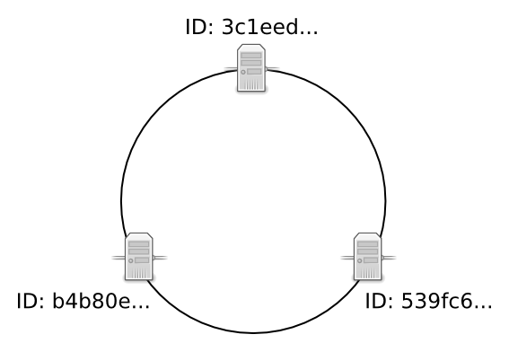
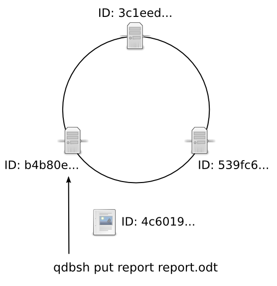
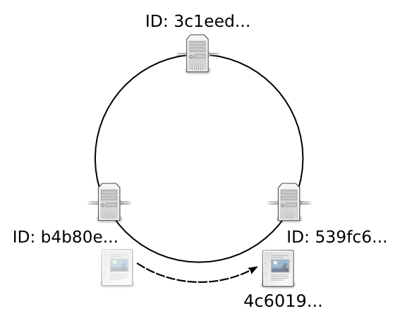
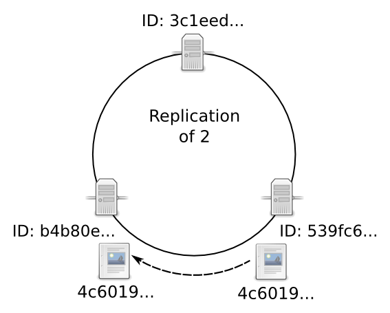

Data Storage
============

.. _data-storage-in-cluster:

Where are Entries Stored in the Cluster?
----------------------------------------

When an entry is added to the cluster, it is assigned a unique ID. This ID is a `SHA-3 <https://en.wikipedia.org/wiki/SHA-3>`_ of the alias. The entry is then placed on the node whose ID is the successor of the entry's ID. If replication is in place, the entry will be copied to other nodes for redundancy.

For example, here is a three node cluster. The nodes have UUID identifiers beginning with 3c1eed, 539fc6, b4b80e, respectively.

A client (qdbsh) puts a file on the b4b80e node. quasardb computes the file's UUID as "4c6019...".

quasardb compares the UUIDs of each node to the UUID for the new entity. Because the new entity's UUID begins with 4, its successor is 539fc6. The file is stored on the 539fc6 node.

If the cluster is configured with a :ref:`data-replication` value of 2, a copy of the file is also stored on the b4b80e node. If the cluster is configured with a data replication value of 3, a copy of the file is stored on each node.

When nodes are added to the cluster, this adds new node UUIDs. Data is automatically migrated to the new successor during stabilization. For more information, see :ref:`data-migration` and :ref:`stabilization`.

Since the location of the entry depends on the order of nodes in the ring, exact control of the entry's location can be done by setting each node's ID in its configuration file. However, it is recommended to let quasardb set the node ID in order to prevent collisions.

.. _data-storage-in-node:

Where are Entries Stored in a Node?
-----------------------------------

Each node saves its data in its "root" directory, determined by its configuration file or the global parameter received from the cluster. By default this is the ``db`` directory under the quasardb daemon's working directory. In production environments, the root folder should be on its own partition. See :doc:`../administration/system_requirements`.

.. caution::
    Never operate directly on the files in the root directory. To backup, dump, analyze, or repair the database, use :doc:`../reference/qdb_dbtool`.

.. caution::
    Never save other files in this directory; they might be deleted or modified by the daemon.

quasardb's persistence layer is built using `RocksDB <https://github.com/facebook/rocksdb>`_. All software that is RocksDB compatible can process the quasardb database file.

Entries are usually stored "as is", unmodified within the database. Data may be compressed for efficiency purposes, but this is transparent to the client and is never done to the detriment of performance.

Entries are often kept resident in a write cache so the daemon can rapidly serve a large amount of simultaneous requests. When a user adds or updates an entry on the cluster the entry's value may not be synced to the disk immediately. However, quasardb guarantees the data is consistent at all times, even in case of hardware or software failure.

If you need to guarantee that every cluster write is synced to disk immediately, disable the write cache by setting the "sync" configuration option to true. Disabling the write cache may have an impact on performance.

.. _transient-mode:

Transient mode
^^^^^^^^^^^^^^

Transient mode disables data storage altogether, transforming quasardb into a pure in-memory database. In transient mode:

    * Performance may increase
    * Memory usage may be reduced
    * Disk usage will be significantly lowered

But:

    * Entries evicted from memory will be lost (see :ref:`eviction`)
    * Double-ended queues may be undefined due to eviction if you reach the memory limit.
    * Node failure may imply irrecoverable data loss
    * Node and cluster statistics will not be recorded
    * Entries cannot be iterated upon

.. _data-migration:

Data Migration
--------------

Data migration is the process of transferring entries from one node to another for the purpose of load balancing. Not to be confused with :ref:`data-replication`.

.. note::
    Data migration is always enabled.

Data migration only occurs when a new node joins the cluster. Nodes may join a cluster when:

    1. The administrator expands the cluster by adding new nodes
    2. A node recovers from failure and rejoins the cluster

Migration Process
^^^^^^^^^^^^^^^^^
At the end of each :ref:`stabilization` cycle, each node requests entries that belong to it from its successor and its predecessor.

For example:

    1. Node N joins the cluster by looking for its successor, Node S.
    2. N stabilizes itself, informing its successor and predecessor of its existence.
    3. When N has both predecessor P and successor S, N request both of them for the [P; N] range of keys
    4. P and S send the requested keys, if any, one by one.

.. note::
    Migration speed depends on the available network bandwidth, the speed of the underlying hardware, and the amount of data to migrate. Therefore, a large amount of data (several gigabytes) on older hardware may negatively impact client performance.

During migration, nodes remain available and will answer to requests. However, since migration occurs *after* the node is registered, there is a time interval during which some entries are being moved to their nodes. These entries may be temporarily unavailable.

Failure scenario:

    1. Node N joins the ring and connects itself with its predecessor, Node P, and its successor Node S.
    2. Meanwhile, a client looks for the entry E. Entry E is currently stored on Node S, but the organization of the cluster now says the successor is Node N.
    3. Because Node N can be found in the ring, the client correctly requests Entry E from Node N.
    4. N answers "not found" because Node S has not migrated E yet.

Entry E will only be unavailable for the duration of the migration and does not result in a data loss. A node will not remove an entry until the peer has fully acknowledged the migration.

.. tip::
    To reduce the chance of unavailable data due to data migration, add nodes when cluster traffic is at its lowest point.

.. _data-replication:

Data replication
-----------------

Data replication is the process of duplicating entries across multiple nodes for the purpose of fault tolerance. Data replication greatly reduces the odds of functional failures at the cost of increased disk and memory usage, as well as reduced performance when adding or updating entries. Not to be confused with :ref:`data-migration`.

.. note::
    Replication is optional and disabled by default, but is highly recommended for production environments (see :doc:`../reference/qdbd`).

Principle
^^^^^^^^^^

Data is replicated on a node's successors. For example, with a factor two replication, an entry will be stored on its primary node and on that node's successor. With a factor three replication, an entry will be stored on its primary node and on its two following successors. Thus, replication linearly increases disk and memory usage.

Replication is done synchronously as data is added or updated. The call will not successfully return until the data has been stored and fully replicated across the appropriate nodes.

When a node fails or when entries are otherwise unavailable, client requests will be served by the successor nodes containing the duplicate data. In order for an entry to become unavailable, all nodes containing the duplicate data need to fail simultaneously. For more information, see :ref:`data-replication-reliability-impact`.

How replication works with migration
^^^^^^^^^^^^^^^^^^^^^^^^^^^^^^^^^^^^^^

When a new node joins a ring, data is migrated (see :ref:`data-migration`) to its new host node. When replication is in place, the migration phase also includes a replication phase that consists in copying entries to the new successors. Thus, replication increases the migration duration. However, during this period, if the original entry is unavailable, the successor node will respond to client requests with the duplicate data.

Conflict resolution
^^^^^^^^^^^^^^^^^^^^^

Because of the way replication works, an original and a replica entry cannot be simultaneously edited. The client will always access the version considered the *original* entry and replicas are always overwritten in favor of the *original*. Replication is completely transparent to the client.

When the original is unavailable due to data migration and the client sends a read-only request, the client will be provided with the replica entry. When the original is unavailable due to data migration and the client sends a write request, the cluster will respond with "unavailable" until the migration is complete.

Formally put, this means that quasardb may choose to sacrifice *Availability* for *Consistency* and *Partitionability* during short periods of time.

.. _data-replication-reliability-impact:

Impact on reliability
^^^^^^^^^^^^^^^^^^^^^^^^^^^^^^^^^^^^^^

For an entry x to become unavailable, all replicas must *simultaneously* fail.

More formally, given a :math:`\lambda(N)` failure rate of a node N, the mean time :math:`\tau` between failures of any given entry for an x replication factor is:

.. math::
    \tau:x \to \frac{1}{{\lambda(N)}^{x}}

This formula assumes that failures are unrelated, which is never completely the case. For example, the failure rates of blades in the same enclosure is correlated. However, the formula is a good enough approximation to exhibit the exponential relation between replication and reliability.

.. tip::
    A replication factor of two is a good compromise between reliability and memory usage as it gives a quadratic increase on reliablity while increasing memory usage by a factor two.

Impact on performance
^^^^^^^^^^^^^^^^^^^^^^^^

All add and update ("write") operations are :math:`\tau` slower when replication is active. Read-only queries are automatically load-balanced across nodes containing replicated entries. Depending on cluster load and network topology, read operations may be faster using data replication.

Replication also increases the time needed to add a new node to the ring by a factor of at most :math:`\tau`.

.. _fault-tolerance:

Fault tolerance
^^^^^^^^^^^^^^^

All failures are temporary, assuming the underlying cause of failure can be fixed (power failure, hardware fault, driver bug, operating system fault, etc.). In most cases, simply repairing the underlying cause of the failure then reconnecting the node to the cluster will resolve the issue.

The persistence layer is able to recover from write failures, which means that one write error will not compromise everything. Disabling the write cache with the "sync" option will further increase reliability.

However, there is one case where data may be lost:

    1. A node fails **and**
    2. Data is not replicated on another node **and**
    3. The data was not persisted to disk **or** storage failed

Note that this can be mitigated using data replication. Replication ensures a node can fully recover from any failure and should be considered for production environments.

.. _eviction:

Memory Cache and Eviction
^^^^^^^^^^^^^^^^^^^^^^^^^

In order to achieve high performance, quasardb keeps as much data as possible in memory. However, a node may not have enough physical memory available to hold all of its entries in RAM. You may enable an eviction limit, which will remove entries from memory when the cache reaches a maximum number of entries or a given size in bytes. See :doc:`../reference/qdbd` for more information.

.. note::
    The memory usage (bytes) limit includes the alias and content for each entry, but doesn't include bookkeeping, temporary copies or internal structures. Thus, the daemon memory usage may slightly exceed the specified maximum memory usage.

The quasardb daemon chooses which entries to evict using a proprietary, *fast monte-carlo* heuristic. Evicted entries stay on disk until requested, at which point they are paged into the cache.

.. _cluster-statistics:

Statistics
----------

As of quasardb 1.1.5, statistics such as CPU, RAM, and disk usage and network traffic are permanently recorded in the database. These can be displayed using the :doc:`../reference/qdb_httpd`. The statistics accrue at a rate of approximately 50 MiB per year. Statistics cannot be disabled unless the cluster is transient.
