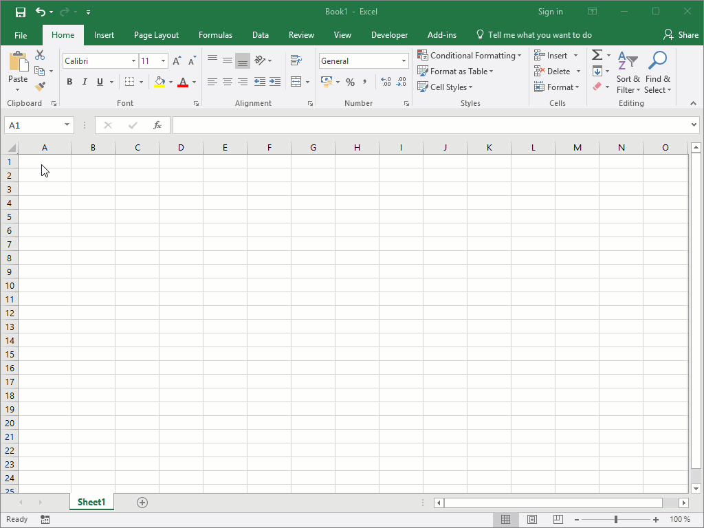

quasardb for Excel
******************

Introduction
============

*quasardb for Excel* is an add-in for Microsoft Excel 2013 and 2016.

It allows using the following features of quasardb within Microsoft Excel:

1. Search entries and list them in a spreadsheet
2. Download time-series in a spreadsheet
3. Get time-series values from spreadsheet formulas

Installation
============

Before installing *quasardb for Excel*, make sure Microsoft Office 2013 or 2016 is installed.

To download *quasardb for Excel*, point your browser to https://download.quasardb.net/quasardb/nightly/excel/.

Two versions of the add-in are available:

1. Use the ``x86`` version if your Microsoft Office installation is compiled for 32-bit architecture.
2. Use the ``x64`` version if your Microsoft Office installation is compiled for 64-bit architecture.

If you pick the wrong version, *quasardb for Excel* will refuse to install; so it's safe to try both versions if you don't know which version of Office is installed.

.. image:: qdb_excel_setup.gif

Speadsheet functions
====================

The following functions return a single value, and operate on double columns:

+---------------------------------------------------------+-------------------------------------------------------------------------------------------------------+
| Function signature                                      | Description                                                                                           |
+=========================================================+=======================================================================================================+
| ``QDB.TS.DOUBLE.ABS.MAX(series,column,begin,end)``      | Returns the maximum of absolute values of the interval ``[begin,end)``.                               |
+---------------------------------------------------------+-------------------------------------------------------------------------------------------------------+
| ``QDB.TS.DOUBLE.ABS.MIN(series,column,begin,end)``      | Returns the minimum of absolute values of the interval ``[begin,end)``.                               |
+---------------------------------------------------------+-------------------------------------------------------------------------------------------------------+
| ``QDB.TS.DOUBLE.AVERAGE(series,column,begin,end)``      | Returns the arithmetic mean of the values in the interval ``[begin,end)``.                            |
+---------------------------------------------------------+-------------------------------------------------------------------------------------------------------+
| ``QDB.TS.DOUBLE.COUNT(series,column,begin,end)``        | Returns the number of points in the interval ``[begin,end)``.                                         |
+---------------------------------------------------------+-------------------------------------------------------------------------------------------------------+
| ``QDB.TS.DOUBLE.FIRST(series,column,begin,end)``        | Returns the first value of the interval ``[begin,end)``.                                              |
+---------------------------------------------------------+-------------------------------------------------------------------------------------------------------+
| ``QDB.TS.DOUBLE.GEOMEAN(series,column,begin,end)``      | Returns the geometric mean of the values in the interval ``[begin,end)``.                             |
+---------------------------------------------------------+-------------------------------------------------------------------------------------------------------+
| ``QDB.TS.DOUBLE.HARMEAN(series,column,begin,end)``      | Returns the harmonic mean of the values in the interval ``[begin,end)``.                              |
+---------------------------------------------------------+-------------------------------------------------------------------------------------------------------+
| ``QDB.TS.DOUBLE.KURT(series,column,begin,end)``         | Returns the kurtosis of the values in the interval ``[begin,end)``.                                   |
+---------------------------------------------------------+-------------------------------------------------------------------------------------------------------+
| ``QDB.TS.DOUBLE.LAST(series,column,begin,end)``         | Returns the last value ofinterval ``[begin,end)``.                                                    |
+---------------------------------------------------------+-------------------------------------------------------------------------------------------------------+
| ``QDB.TS.DOUBLE.MAX(series,column,begin,end)``          | Returns the maximum of the interval ``[begin,end)``.                                                  |
+---------------------------------------------------------+-------------------------------------------------------------------------------------------------------+
| ``QDB.TS.DOUBLE.MIN(series,column,begin,end)``          | Returns the minimum of the interval ``[begin,end)``.                                                  |
+---------------------------------------------------------+-------------------------------------------------------------------------------------------------------+
| ``QDB.TS.DOUBLE.PRODUCT(series,column,begin,end)``      | Returns the product of the values in the interval ``[begin,end)``.                                    |
+---------------------------------------------------------+-------------------------------------------------------------------------------------------------------+
| ``QDB.TS.DOUBLE.QUADMEAN(series,column,begin,end)``     | Returns the quadratic mean (root mean square) of the values in the interval ``[begin,end)``.          |
+---------------------------------------------------------+-------------------------------------------------------------------------------------------------------+
| ``QDB.TS.DOUBLE.SKEW(series,column,begin,end)``         | Returns the skewness of the values in the interval ``[begin,end)``.                                   |
+---------------------------------------------------------+-------------------------------------------------------------------------------------------------------+
| ``QDB.TS.DOUBLE.SPREAD(series,column,begin,end)``       | Returns the difference between the maximum and the minimum in the interval ``[begin,end)``.           |
+---------------------------------------------------------+-------------------------------------------------------------------------------------------------------+
| ``QDB.TS.DOUBLE.STDDEV.P(series,column,begin,end)``     | Returns the population standard deviation of the values in the interval ``[begin,end)``.              |
+---------------------------------------------------------+-------------------------------------------------------------------------------------------------------+
| ``QDB.TS.DOUBLE.STDDEV.S(series,column,begin,end)``     | Returns the sample standard deviation of the values in the interval ``[begin,end)``.                  |
+---------------------------------------------------------+-------------------------------------------------------------------------------------------------------+
| ``QDB.TS.DOUBLE.SUM(series,column,begin,end)``          | Returns the sum of the values in the interval ``[begin,end)``.                                        |
+---------------------------------------------------------+-------------------------------------------------------------------------------------------------------+
| ``QDB.TS.DOUBLE.SUMSQ(series,column,begin,end)``        | Returns the sum of squares of the value in the interval ``[begin,end)``.                              |
+---------------------------------------------------------+-------------------------------------------------------------------------------------------------------+
| ``QDB.TS.DOUBLE.VAR.P(series,column,begin,end)``        | Returns the population variance of the values in the interval ``[begin,end)``.                        |
+---------------------------------------------------------+-------------------------------------------------------------------------------------------------------+
| ``QDB.TS.DOUBLE.VAR.S(series,column,begin,end)``        | Returns the sample variance of the values in the interval ``[begin,end)``.                            |
+---------------------------------------------------------+-------------------------------------------------------------------------------------------------------+

.. image:: qdb_excel_sum.gif

The following function returns an array, and must be used in an "array-formula" (Control+Shift+Enter):

+--------------------------------------------+----------------------------------------------------------------------------------------------------------+
| Function signature                         | Description                                                                                              |
+============================================+==========================================================================================================+
| ``QDB.TS.POINTS(series,column,begin,end)`` | Returns all the points the average value of the specified time-series in the interval ``[begin,end)``.   |
|                                            | The result is an array with two columns; the first contains the timestamp, the second contains the value |
+--------------------------------------------+----------------------------------------------------------------------------------------------------------+

.. image:: qdb_excel_points.gif

Ribbon buttons
==============

*quasardb for Excel* adds two buttons in the Excel ribbon, in the "Add-ins" tab.

1. The "Time Series" button opens a wizard to download time-series in the spreadsheet
2. The "Find" button allows searching entries in the database

