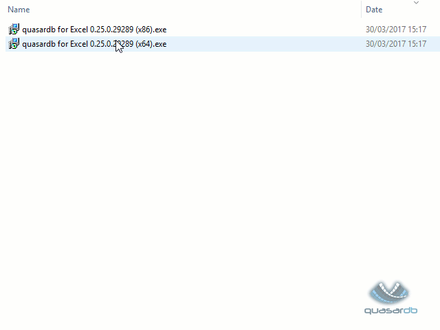
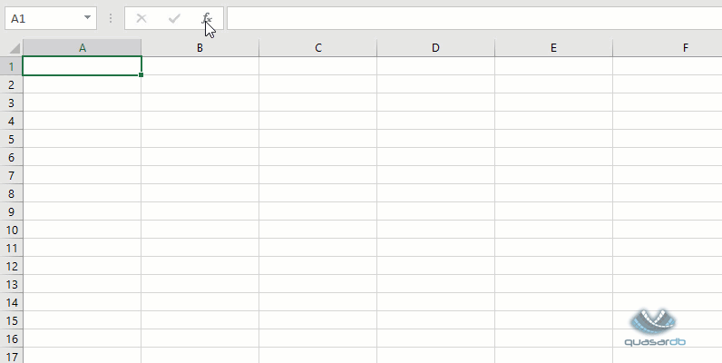
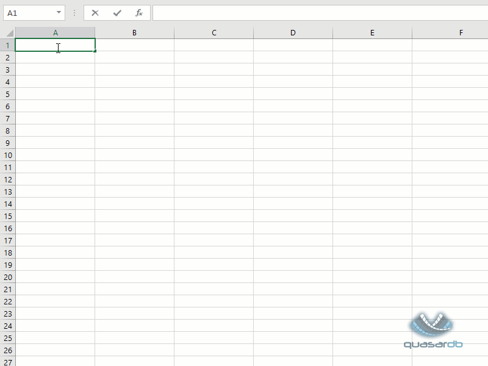

quasardb for Excel
******************

Introduction
============

*quasardb for Excel* is an add-in for Microsoft Excel 2013 and 2016.

It allows using the following features of quasardb within Microsoft Excel:

1. Search entries and list them in a spreadsheet
2. Download time-series in a spreadsheet
3. Get time-series values from spreadsheet formulas

Installation
============

Before installing *quasardb for Excel*, make sure Microsoft Office 2013 or 2016 is installed.

To download *quasardb for Excel*, point your browser to https://download.quasardb.net/quasardb/nightly/excel/.

Two versions of the add-in are available:

1. Use the ``x86`` version if your Microsoft Office installation is compiled for 32-bit architecture.
2. Use the ``x64`` version if your Microsoft Office installation is compiled for 64-bit architecture.

If you pick the wrong version, *quasardb for Excel* will refuse to install; so it's safe to try both versions if you don't know which version of Office is installed.

Speadsheet functions
====================

The following functions return a single value, they can be use in any formula:

+---------------------------------------------+-------------------------------------------------------------------------------------------------------+
| Function signature                          | Description                                                                                           |
+=============================================+=======================================================================================================+
| ``QDB.TS.AVERAGE(series,column,begin,end)`` | Returns the average value of the specified time-series in the interval ``[begin,end[``.               |
+---------------------------------------------+-------------------------------------------------------------------------------------------------------+
| ``QDB.TS.COUNT(series,column,begin,end)``   | Returns the number of points that the specified time-series contains in the interval ``[begin,end[``. |
+---------------------------------------------+-------------------------------------------------------------------------------------------------------+
| ``QDB.TS.FIRST(series,column,begin,end)``   | Returns the first value of the specified time-series in the interval ``[begin,end[``.                 |
+---------------------------------------------+-------------------------------------------------------------------------------------------------------+
| ``QDB.TS.MAX(series,column,begin,end)``     | Returns the maximum value of the specified time-series in the interval ``[begin,end[``.               |
+---------------------------------------------+-------------------------------------------------------------------------------------------------------+
| ``QDB.TS.MIN(series,column,begin,end)``     | Returns the minimum value of the specified time-series in the interval ``[begin,end[``.               |
+---------------------------------------------+-------------------------------------------------------------------------------------------------------+
| ``QDB.TS.LAST(series,column,begin,end)``    | Returns the last value of the specified time-series in the interval ``[begin,end[``.                  |
+---------------------------------------------+-------------------------------------------------------------------------------------------------------+
| ``QDB.TS.SUM(series,column,begin,end)``     | Returns the sum of the specified time-series in the interval ``[begin,end[``.                         |
+---------------------------------------------+-------------------------------------------------------------------------------------------------------+

The following function returns an array, it should be used in an "array-formula" (Control+Shift+Enter):

+--------------------------------------------+----------------------------------------------------------------------------------------------------------+
| Function signature                         | Description                                                                                              |
+============================================+==========================================================================================================+
| ``QDB.TS.POINTS(series,column,begin,end)`` | Returns all the points the average value of the specified time-series in the interval ``[begin,end[``.   |
|                                            | The result is an array with two columns; the first contains the timestamp, the second contains the value |
+--------------------------------------------+----------------------------------------------------------------------------------------------------------+

Ribbon buttons
==============

*quasardb for Excel* adds two buttons in the Excel ribbon, in the "Add-ins" tab.

1. The "Time Series" button opens a wizard to download time-series in the spreadsheet
2. The "Find" button allows searching entries in the database
