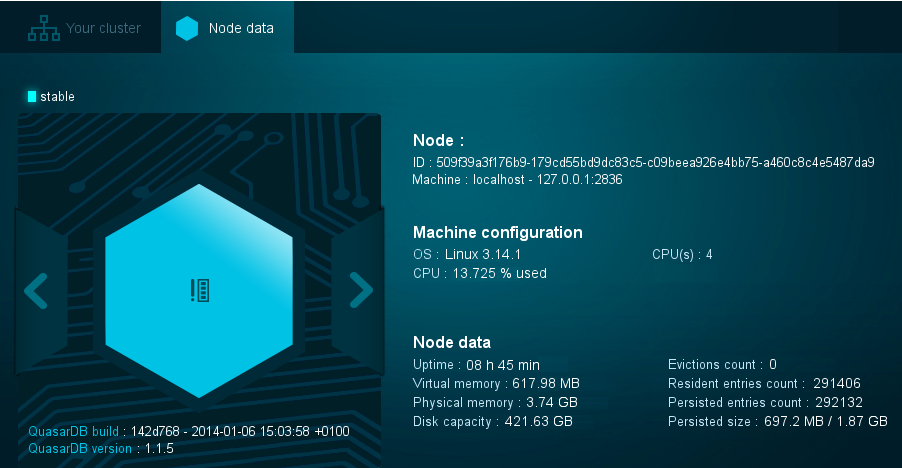
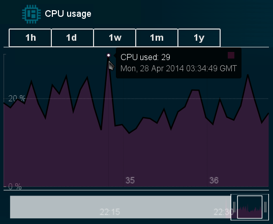

quasardb web server
*******************

.. highlight:: js
.. program:: qdb_httpd

Introduction
============

The quasardb web server, qdb_httpd, provides two services:
 * An HTML5 GUI that shows an overview of cluster and node activity
 * A RESTful API that can translate entries from the cluster into JSON or JSONP.

The web server is extremely flexible:
 * There is no launch order. The cluster can be started after the web server or vice versa.
 * The web server can be stopped and started at any time without any information loss.
 * All content provided by the web server, whether HTML or JSON, is *real time*.

Multiple web servers can be installed and run simultaneously for redundancy, but only one is needed to monitor the entire cluster.

Quick Reference
===============

 ===================================== ============================ =================== ==============
                Option                               Usage               Default         Req. Version
 ===================================== ============================ =================== ==============
 :option:`-h`                          display help                                     
 :option:`-v`                          display version information                       
 :option:`--gen-config`                generate default config file                      >=1.1.3
 :option:`-c`, `--config-file`         specify config file                               >=1.1.3
 :option:`-d`, `--daemonize`           daemonize                                        
 :option:`-a`, `--address`             address to listen on         127.0.0.1:8080      
 :option:`-r`, `--root`                html files directory         ./html              
 :option:`--node`                      address:port of server       127.0.0.1:2836      
 :option:`-l`, `--log-file`            log on given file                                
 :option:`--log-dump`                  dump file location           qdb_error_dump.txt  
 :option:`--log-flush-interval`        change log flush             3                   
 :option:`--log-level`                 change log level             info                
 :option:`--log-syslog`                log on syslog                                    
 :option:`-t`, `--threads`             number of threads to use     1                  
 ===================================== ============================ =================== ==============

Launching the qdb_httpd daemon
==============================

The web server binary is qdb_httpd (qdb_httpd.exe on Windows). By default it listens on the IPv4 localhost (127.0.0.1) and the port 8080. This can be configured using either a configuration file or by command-line arguments. See :ref:`qdb_httpd-config-file-reference` and :ref:`qdb_httpd-parameters-reference`, respectively. A configuration file is recommended.

In FreeBSD or Linux you can run the http daemon with::

    qdb_httpd -c qdb_httpd_config_file.json

or on Windows::

    qdb_httpd.exe -c qdb_httpd_config_file.json

The server does not require specific privileges to run (i.e. you don't need to run the server from an administrator account).

Using the qdb_httpd HTML interface
==================================

To view the qdb_httpd web interface, point a browser to the /view folder on the server's IP address and port. By default this URL is http://127.0.0.1:8080/view/index.html. If viewing from a remote machine, consult the qdb_httpd daemon's configuration file.

The web interface has two tabs, the "Your Cluster" tab, showing an overview of the cluster, and the "Node Data" tab, where you can drill down into a specific qdbd node. As of 1.1.3, the web interface can display up to 32 nodes in a cluster.

Your Cluster
~~~~~~~~~~~~

The "Your Cluster" tab begins with a list of current cluster statistics.

The cluster stability and number of nodes are shown in the image to the left. Each hexagon corresponds to a node. When you hover over a hexagon, an overview of the node will appear. From there, you can access its Node Data tab for more detailed information.

The table on the right shows live statistics from the cluster.

 * General Data
 
   - Cluster Status: The overall status of the cluster.
   - Evictions Count: The number of entries that were rejected due to node or cluster limits.
 
 * Aggregated Data
 
   - Persisted Size: The size of all data stored on all disks across all nodes.
   - Resident Size: The size of data stored on RAM across all nodes.
   - Persisted Entries Count: The number of entries stored in disk across all nodes.
   - Resident Entries Count: The number of entries stored on RAM across all nodes.
 
 * Aggregated operations statistics
 
   - put: The number of put operations the cluster has received from clients.
   - get: The number of get operations the cluster has received from clients.
   - update: The number of get operations the cluster has received from clients.
   - compare and swap: The number of compare and swap operations the cluster has received from clients.
   - get and update: The number of get and update operations the cluster has received from clients.
   - remove: The number of remove operations the cluster has received from clients.
   - remove if: The number of remove if operations the cluster has received from clients.

Beneath the statistics are six live graphs:

The graphs show:

 * CPU usage percentage for all nodes over time
 * Memory usage percentage for all nodes over time
 * Persistent size (disk usage) percentage for all nodes over time
 * Resident size (RAM usage) percentage for all nodes over time
 * Input network traffic percentage for all nodes over time
 * Output network traffic percentage for all nodes over time

Each graph displays historical cluster data for the past hour, day, week, month, or year, depending on the selected tab. You can filter the graph data even further by resizing and moving the window at the bottom of the graph.

Hover over the black line on the graph to display detailed information about the selected data point.

Node Data
~~~~~~~~~

The "Node Data" tab begins with a list of statistics about the selected node.

The node stability is shown at the top left. The hexagon in the center corresponds to the current node. When you click the left or right arrows, you can switch between each node in the ring. The quasardb build and version information is shown beneath the ring.

The table on the right shows live statistics from the selected node.

 * Node ID: The unique hexadecimal node ID assigned as part of its configuration file or when it joined the cluster.
 * Machine Configuration
 
   - OS: The operating system of the node.
   - CPU: The CPU model of the node.
 
 * Node Data
 
   - Uptime: The amount of time in hours and minutes the node has been online.
   - Virtual Memory: The total amount of memory in the node, including swap space.
   - Physical Memory: The total amount of physical memory in the node.
   - Disk Capacity: The total storage capacity of this node's disk.
   - Evictions Count: The number of entries that were rejected due to node or cluster limits.
   - Resident Entries Count: The number of entries stored on this node's RAM.
   - Persisted Entries Count: The number of entries stored in this node's disk.
   - Persisted Size: The sum of all data stored on all disks on this node.

Beneath the node stats are operation statistics. These detail the operations the node has been performing for clients, as well as the partitions (similar to threads) the node has been using to perform the operations.

Node Operation Statistics

   - put: The number of put operations the cluster has received from clients.
   - get: The number of get operations the cluster has received from clients.
   - update: The number of get operations the cluster has received from clients.
   - compare and swap: The number of compare and swap operations the cluster has received from clients.
   - get and update: The number of get and update operations the cluster has received from clients.
   - remove: The number of remove operations the cluster has received from clients.
   - remove if: The number of remove if operations the cluster has received from clients.

Sessions information by partition
 
   - Each partition is shown with a number of available simultaneous connections out of its maximum simultaneous connections. The maximum number of connections is determined by your license file.

There are two download buttons beneath the operation statistics:

    

The buttons have the following effects:

 * The "Raw JSON data" button retrieves the raw status information of the node. See "global_status" in the :ref:`qdb_httpd-url-reference` below.
 * The "Configuration as JSON" button retrieves the configuration information of the node. See "config" in the :ref:`qdb_httpd-url-reference` below.

The bottom half of the view shows six live graphs:

The graphs show:

 * CPU usage percentage for all processes on the node over time
 * Memory usage percentage for all processes on the node over time
 * Persistent size (disk usage) percentage for all processes on the node over time
 * Resident size (RAM usage) percentage for all processes on the node over time
 * Input network traffic percentage for all processes on the node over time
 * Output network traffic percentage for all processes on the node over time

Each graph displays historical cluster data for the past hour, day, week, month, or year, depending on the selected tab. You can filter the graph data even further by resizing and moving the window at the bottom of the graph.

Hover over the black line on the graph to display detailed information about the selected data point.

Using the qdb_httpd JSON interface
==================================

The server only accepts specific URLs and will service JSON or JSONP data depending on the URL and its parameters. If the URL does not exist, the server will return a page not found (404) error.

A comprehensive list of urls and parameters is listed below at :ref:`qdb_httpd-url-reference`. 

.. _qdb_httpd-parameters-reference:

Parameters Reference
====================

Parameters can be supplied in any order and are prefixed with ``--``. The arguments format is parameter dependent.

.. option:: -h, --help

    Displays basic usage information.

    Example
        To display the online help, type: ::

            qdb_httpd --help

.. option:: -v

    Displays qdb_httpd version information.

.. option:: --gen-config

    Generates a JSON configuration file with default values and prints it to STDOUT.

    Example
        To create a new config file with the name "qdb_httpd_default_config.json", type: ::

            qdb_httpd --gen-config > qdb_httpd_default_config.json
    
    .. note::
        The --gen-config argument is only available with QuasarDB 1.1.3 or higher.

.. option:: -c, --config-file

    Specifies a configuration file to use. See :ref:`qdb_httpd-config-file-reference`.
    
        * Any other command-line options will be ignored.
        * If an option is omitted in the config file, the default will be used.
        * If an option is malformed in the config file, it will be ignored.
    
    Argument
        The path to a valid configuration file.

    Example
        To use a configuration file named "qdb_httpd_default_config.json", type: ::

            qdb_httpd --config-file=qdb_httpd_default_config.json
        
    .. note::
        The --config-file argument is only available with QuasarDB 1.1.3 or higher.

.. option:: -d, --daemonize

    Runs the server as a daemon (UNIX only). In this mode, the process will fork and prevent console interactions. This is the recommended running mode for UNIX environments.

    Example
        To run as a daemon::

            qdb_httpd -d

.. option:: -a <address>:<port>, --address=<address>:<port>

    Specifies the address and port on which the server will listen.

    Argument
        A string representing an address and port the server should listen on. The string can be a host name or an IP address.

    Default value
        127.0.0.1:8080, the IPv4 localhost and the port 8080

    Example
        Listen on all addresses and the port 80::

            qdbd --address=0.0.0.0:80

.. option:: -r <path>, --root <path>

    Specifies the root directory where the administration HTML files lie.

    Argument
        A string representing the path (relative or absolute) to the administration HTML files.

    Default value
        html

.. option:: --node <address>:<port>

   Specifies the address and port of the node to which the http server will connect.

   Argument
        The address and port of a machine where a quasardb node is running. The string can be a host name or an IP address.

   Default value
        127.0.0.0:2836, the IPv4 localhost address and the port 2836

   Example
        If the node listens on localhost and the port 5009::

            qdb_httpd --node=localhost:5009

.. option:: -l <path>, --log-file=<path>

    Activates logging to one or several files.

    Argument
        A string representing one (or several) path(s) to the log file(s).

    Example
        Log in /var/log/qdbd.log: ::

            qdb_httpd --log-file=/var/log/qdbd.log

.. option:: --log-dump=<path>

    Activates logging to a system error dump file in case of a crash.

    Argument
        A string representing a relative or absolute path to the dump file.

    Example
        Dump to qdb_error_dump.txt: ::

            qdb_httpd --log-dump=qdb_error_dump.txt

.. option:: --log-syslog

    Activates logging to the system log.

.. option:: --log-level=<value>

    Specifies the log verbosity.

    Argument
        A string representing the amount of logging required. Must be one of:

        * detailed (most output)
        * debug
        * info
        * warning
        * error
        * panic (least output)

    Default value
        info

    Example
        Request a debug level logging: ::

            qdb_httpd --log-level=debug

.. option:: --log-flush-interval=<delay>

    How frequently log messages are flushed to output, in seconds.

    Argument
        An integer representing the number of seconds between each flush.

    Default value
        3

    Example
        Flush the log every minute: ::

            qdb_httpd --log-flush-interval=60

.. option:: -t <count>, --threads=<count>

    Specifies the number of threads to use. May improve performance.

    Argument
        An integer greater than 0 representing the number of listening threads.

    Default value
        1

    Example
        To use two listening threads::

            qdb_httpd --threads=2

.. highlight:: html

.. _qdb_httpd-config-file-reference:

Config File Reference
=====================

As of QuasarDB version 1.1.3, the qdb_httpd daemon can read its parameters from a JSON configuration file provided by the :option:`-c` command-line argument. Using a configuration file is recommended.

Some things to note when working with a configuration file:

 * If a configuration file is specified, all other command-line options will be ignored. Only values from the configuration file will be used.
 * The configuration file must be valid JSON in ASCII format.
 * If a key or value is missing from the configuration file or malformed, the default value will be used.
 * If a key or value is unknown, it will be ignored.

The default configuration file is shown below::

    {
        "daemonize": false,
        "doc_root": "html",
        "listen_on": "127.0.0.1:8080",
        "log_config":
        {
            "dump_file": "qdb_error_dump.txt",
            "flush_interval": 3,
            "log_files": [  ],
            "log_level": 2,
            "log_to_console": false,
            "log_to_syslog": false
        },
        "remote_node": "127.0.0.1:2836",
        "threads": 1
    }

.. describe:: daemonize

    A boolean value representing whether or not the qdb_httpd daemon should daemonize on launch.
    
.. describe:: doc_root

    A string representing the relative or absolute path to the administration HTML files.

.. describe:: listen_on

    A string representing an address and port the web server should listen on. The string can be a host name or an IP address. Must have name or IP separated from port with a colon.

.. describe:: log_config::dump_file

    A string representing the relative or absolute path to the system error dump file.

.. describe:: log_config::flush_interval

    An integer representing how frequently qdb_httpd log messages should be flushed to the log locations, in seconds.

.. describe:: log_config::log_files

    An array of strings representing the relative or absolute paths to the qdb_httpd log files.

.. describe:: log_config::log_level

    An integer representing the verbosity of the log output. Acceptable values are::
    
        0 = detailed (most output)
        1 = debug
        2 = info (default)
        3 = warning
        4 = error
        5 = panic (least output)

.. describe:: log_config::log_to_console

    A boolean value representing whether or not the qdb_httpd daemon should log to the console it was spawned from.  This value is ignored if local::user::daemon is true.

.. describe:: log_config::log_to_syslog

    A boolean value representing whether or not the qdb_httpd daemon should log to the syslog.

.. describe:: remote_node

    A string representing an address and port where the server can find a QuasarDB daemon. The string can be a host name or an IP address. Must have name or IP separated from port with a colon.

.. describe:: threads

    An integer representing the number of listening threads qdb_httpd should use. Higher numbers of threads may increase qdb_httpd performance.

.. _qdb_httpd-url-reference:

qdb_httpd JSON/JSONP URL reference
==================================

.. describe:: get

    Obtain an entry from the cluster.

    :param alias: specifies the alias of the entry to obtain.
    :param callback: *(optional)* specifies a callback in order to obtain JSONP output instead of JSON (required for cross site scripting).
    :returns: A JSON or JSONP structure containing the alias and content (in Base64) of the entry. If the entry cannot be found, the content string will be empty.

    *Schema*::

        {
            "name":"get",
            "properties":
            {
                "alias":
                {
                    "type":"string",
                    "description":"alias name of the entry",
                    "required":true
                },
                "content":
                {
                    "type":"string",
                    "description":"Base64 encoding of the entry's content",
                    "required":true
                }
            }
        }

    *Example*:
        Get the entry with the alias ``MyData`` from the server ``myserver.org`` listening on the port 8080::

            http://myserver.org:8080/get?alias=MyData

    .. note::
        Requesting large entries (i.e., larger than 10 MiB) through the web bridge is not recommended.

.. describe:: config

    Obtain node configuration.

    :param callback: *(optional)* specifies a callback in order to obtain JSONP output instead of JSON (required for cross site scripting).
    :returns: A JSON or JSONP structure with the node configuration.

.. describe:: topology

    Obtain node topology, that is, the id, ip address and port of the node's successor and predecessor.

    :param callback: *(optional)* specifies a callback in order to obtain JSONP output instead of JSON (required for cross site scripting).
    :returns: A JSON or JSONP structure with the node topology.

.. describe:: global_status

    Obtain global statistics.

    :param callback: *(optional)* specifies a callback in order to obtain JSONP output instead of JSON (required for cross site scripting).
    :returns: A JSON or JSONP structure with up-to-date statistics.

    *Schema*::

        {
            "name":"global_status",
            "properties":
            {
                "name":"memory",
                "properties":
                {
                    "name":"physmem",
                    "properties":
                    {
                        "used":
                        {
                            "type":"number",
                            "description":"the number of physical memory bytes used",
                            "required":true
                        },
                        "total":
                        {
                            "type":"number",
                            "description":"the total number of physical memory bytes",
                            "required":true
                        }
                    },
                    "name":"vm",
                    "properties":
                    {
                        "used":
                        {
                            "type":"number",
                            "description":"the number of virtual memory bytes used",
                            "required":true
                        },
                        "total":
                        {
                            "type":"number",
                            "description":"the total number of virtual memory bytes",
                            "required":true
                        }
                    }
                },
                "node_id":
                {
                    "type":"string",
                    "description":"the unique 256-bit node's identifier",
                    "required":true
                },
                "operating_system":
                {
                    "type":"string",
                    "description":"the operating system the daemon is running on",
                    "required":true
                },
                "hardware_concurrency":
                {
                    "type":"number",
                    "description":"the maximum number of threads that may concurrently execute on the platform the daemon is running on",
                    "required":true
                },
                "listening_addresses":
                {
                    "type":"array",
                    "items":
                    {
                        "type":"string"
                    },
                    "description":"the addresses and port the daemon listens on",
                    "required":true
                },
                "partitions_count":
                {
                    "type":"number",
                    "description":"the number of partitions",
                    "required":true
                },
                "timestamp":
                {
                    "type":"string",
                    "description":"the timestamp of the latest statistics update",
                    "required":true
                },
                "startup":
                {
                    "type":"string",
                    "description":"the startup timestamp",
                    "required":true
                },
                "engine_version":
                {
                    "type":"string",
                    "description":"the engine version",
                    "required":true
                },
                "engine_build_date":
                {
                    "type":"string",
                    "description":"the engine build timestamp",
                    "required":true
                },
                "name":"overall",
                "properties":
                {
                    "count":
                    {
                        "type":"number",
                        "description":"The total number of operations",
                        "required":true
                    },
                    "successes":
                    {
                        "type":"number",
                        "description":"The total number of successful operations",
                        "required":true
                    },
                    "failures":
                    {
                        "type":"number",
                        "description":"The total number of failed operations",
                        "required":true
                    },
                    "pageins":
                    {
                        "type":"number",
                        "description":"The total number of pageins",
                        "required":true
                    },
                    "evictions":
                    {
                        "type":"number",
                        "description":"The total number of evictions",
                        "required":true
                    },
                    "size":
                    {
                        "type":"number",
                        "description":"The total size of data in bytes moved in and out",
                        "required":true
                    }
                },
                "name":"entries",
                "properties":
                {
                    "name":"resident",
                    "properties":
                    {
                        "count":
                        {
                            "type":"number",
                            "description":"The total number of resident entries",
                            "required":true
                        },
                        "size":
                        {
                            "type":"number",
                            "description":"The total number of resident bytes",
                            "required":true
                        }
                    },
                    "name":"persisted",
                    "properties":
                    {
                        "count":
                        {
                            "type":"number",
                            "description":"The total number of persisted entries (may lag)",
                            "required":true
                        },
                        "size":
                        {
                            "type":"number",
                            "description":"The total number of persisted bytes (may lag)",
                            "required":true
                        }
                    }
                },
                "name":"operations",
                "properties":
                {
                    "name":"find",
                    "properties":
                    {
                        "count":
                        {
                            "type":"number",
                            "description":"The total number of times the operation has been requested",
                            "required":true
                        },
                        "successes":
                        {
                            "type":"number",
                            "description":"The total number of successful operations",
                            "required":true
                        },
                        "failures":
                        {
                            "type":"number",
                            "description":"The total number of failed operations",
                            "required":true
                        },
                        "pageins":
                        {
                            "type":"number",
                            "description":"The total number of pageins",
                            "required":true
                        },
                        "evictions":
                        {
                            "type":"number",
                            "description":"The total number of evictions",
                            "required":true
                        },
                        "size":
                        {
                            "type":"number",
                            "description":"The total size of data in bytes moved in and out",
                            "required":true
                        }
                    },
                    "name":"put",
                    "properties":
                    {
                        "count":
                        {
                            "type":"number",
                            "description":"The total number of times the operation has been requested",
                            "required":true
                        },
                        "successes":
                        {
                            "type":"number",
                            "description":"The total number of successful operations",
                            "required":true
                        },
                        "failures":
                        {
                            "type":"number",
                            "description":"The total number of failed operations",
                            "required":true
                        },
                        "pageins":
                        {
                            "type":"number",
                            "description":"The total number of pageins",
                            "required":true
                        },
                        "evictions":
                        {
                            "type":"number",
                            "description":"The total number of evictions",
                            "required":true
                        },
                        "size":
                        {
                            "type":"number",
                            "description":"The total size of data in bytes moved in and out",
                            "required":true
                        }
                    },
                    "name":"update",
                    "properties":
                    {
                        "count":
                        {
                            "type":"number",
                            "description":"The total number of times the operation has been requested",
                            "required":true
                        },
                        "successes":
                        {
                            "type":"number",
                            "description":"The total number of successful operations",
                            "required":true
                        },
                        "failures":
                        {
                            "type":"number",
                            "description":"The total number of failed operations",
                            "required":true
                        },
                        "pageins":
                        {
                            "type":"number",
                            "description":"The total number of pageins",
                            "required":true
                        },
                        "evictions":
                        {
                            "type":"number",
                            "description":"The total number of evictions",
                            "required":true
                        },
                        "size":
                        {
                            "type":"number",
                            "description":"The total size of data in bytes moved in and out",
                            "required":true
                        }
                    },
                    "name":"find_update",
                    "properties":
                    {
                        "count":
                        {
                            "type":"number",
                            "description":"The total number of times the operation has been requested",
                            "required":true
                        },
                        "successes":
                        {
                            "type":"number",
                            "description":"The total number of successful operations",
                            "required":true
                        },
                        "failures":
                        {
                            "type":"number",
                            "description":"The total number of failed operations",
                            "required":true
                        },
                        "pageins":
                        {
                            "type":"number",
                            "description":"The total number of pageins",
                            "required":true
                        },
                        "evictions":
                        {
                            "type":"number",
                            "description":"The total number of evictions",
                            "required":true
                        },
                        "size":
                        {
                            "type":"number",
                            "description":"The total size of data in bytes moved in and out",
                            "required":true
                        }
                    },
                    "name":"compare_and_swap",
                    "properties":
                    {
                        "count":
                        {
                            "type":"number",
                            "description":"The total number of times the operation has been requested",
                            "required":true
                        },
                        "successes":
                        {
                            "type":"number",
                            "description":"The total number of successful operations",
                            "required":true
                        },
                        "failures":
                        {
                            "type":"number",
                            "description":"The total number of failed operations",
                            "required":true
                        },
                        "pageins":
                        {
                            "type":"number",
                            "description":"The total number of pageins",
                            "required":true
                        },
                        "evictions":
                        {
                            "type":"number",
                            "description":"The total number of evictions",
                            "required":true
                        },
                        "size":
                        {
                            "type":"number",
                            "description":"The total size of data in bytes moved in and out",
                            "required":true
                        }
                    },
                    "name":"remove",
                    "properties":
                    {
                        "count":
                        {
                            "type":"number",
                            "description":"The total number of times the operation has been requested",
                            "required":true
                        },
                        "successes":
                        {
                            "type":"number",
                            "description":"The total number of successful operations",
                            "required":true
                        },
                        "failures":
                        {
                            "type":"number",
                            "description":"The total number of failed operations",
                            "required":true
                        },
                        "pageins":
                        {
                            "type":"number",
                            "description":"The total number of pageins",
                            "required":true
                        },
                        "evictions":
                        {
                            "type":"number",
                            "description":"The total number of evictions",
                            "required":true
                        },
                        "size":
                        {
                            "type":"number",
                            "description":"The total size of data in bytes moved in and out",
                            "required":true
                        }
                    },
                    "name":"remove_all",
                    "properties":
                    {
                        "count":
                        {
                            "type":"number",
                            "description":"The total number of times the operation has been requested",
                            "required":true
                        },
                        "successes":
                        {
                            "type":"number",
                            "description":"The total number of successful operations",
                            "required":true
                        },
                        "failures":
                        {
                            "type":"number",
                            "description":"The total number of failed operations",
                            "required":true
                        },
                        "pageins":
                        {
                            "type":"number",
                            "description":"The total number of pageins",
                            "required":true
                        },
                        "evictions":
                        {
                            "type":"number",
                            "description":"The total number of evictions",
                            "required":true
                        },
                        "size":
                        {
                            "type":"number",
                            "description":"The total size of data in bytes moved in and out",
                            "required":true
                        }
                    }
                }
            }
        }

    *Example*:
        Regular JSON output from the server ``myserver.org`` listening on the port 8080::

            http://myserver.org:8080/global_status

        JSONP output with a callback named "MyCallback" from the server myserver.org listening on the port 8080::

            http://myserver.org:8080/global_status?callback=MyCallback

